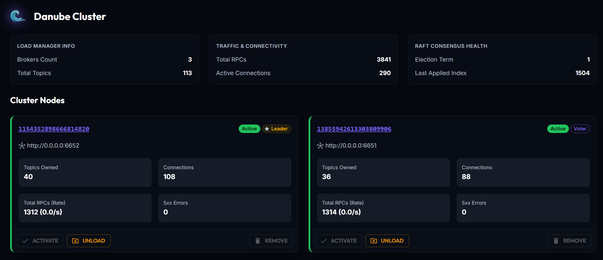
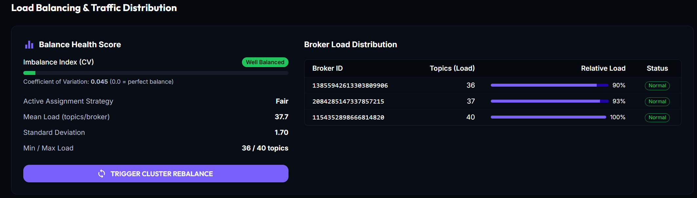
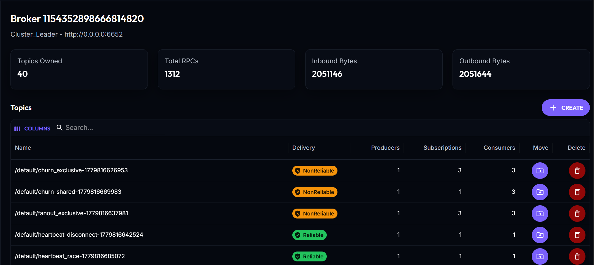
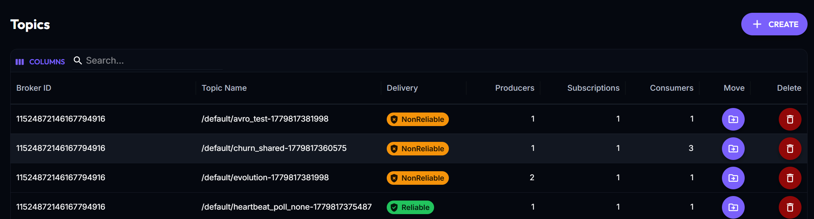
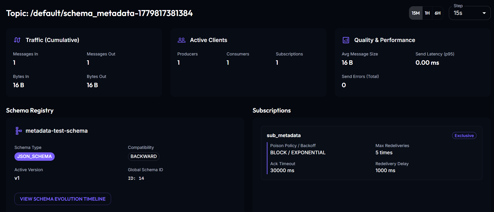
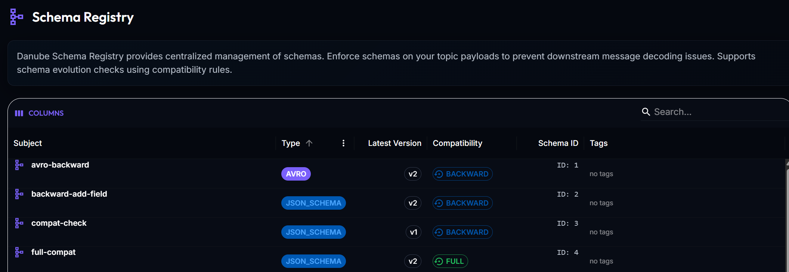

import { Card, CardGrid, Steps } from '@astrojs/starlight/components';

The **Danube Admin UI** is a modern, responsive web dashboard designed for cluster operators and developers. It provides full visibility into cluster state, namespace topology, topic metrics, schema registry configurations, and security policies.

---

## How It Works

The Admin UI is a single-page web application (built with React and Material UI) that runs entirely in your browser. 

It communicates over REST/HTTP with the **Danube Admin Server**, a lightweight Rust backend (referred to as the BFF, or Backend-for-Frontend) that acts as a gateway between the UI and your cluster. The Admin Server translates HTTP requests into gRPC calls directed at the active cluster leader broker, and also queries Prometheus for real-time throughput metrics.

---

## Guided Tour

Here is a walkthrough of the main pages in the Danube Admin UI.

### Cluster Dashboard
The landing page is your operational command center. It is organized into three main areas:

**Cluster Info Panels**: Three summary cards at the top give you an instant snapshot of the cluster:
* **Load Manager Info**: Active broker count and total topic count across the cluster.
* **Traffic & Connectivity**: Aggregate RPC totals and the number of active client connections.
* **Raft Consensus Health**: The current election term and last applied log index, confirming that the consensus layer is healthy and converging.

**Cluster Nodes**: Each broker is displayed as a card showing its Raft role, status, and live stats. Operational actions like Activate, Unload, Promote, and Remove are available directly from each card.



**Load Balancing & Traffic Distribution**: Shows the cluster's balance health score, per-broker load distribution, and lets you trigger a cluster rebalance with an optional dry-run preview.



### Broker Details
Clicking on a broker card takes you to the broker detail page. Here you can see the full list of topics currently assigned to that broker, along with per-topic stats such as subscription counts and producer/consumer activity.



### Topics
The Topics page lists all topics across the cluster with key metadata at a glance: delivery type,  active producer, subscriptions and consumers.



Clicking on a topic opens its detail page, where you can inspect traffic metrics, active producers and consumers, subscriptions, and the schema associated with the topic.



### Schema Registry
The Schema Registry page provides a browsable view of all registered schemas. You can inspect individual schema definitions, see which topics reference them, and review schema versions.



### Namespaces
The Namespaces page lists all active namespaces in the cluster. You can create new namespaces or inspect administrative properties, allowing you to segment your messaging resources by environment, team, or application.

### Security & RBAC
Manage access control policies for your messaging resources. You can configure custom roles with fine-grained permissions (e.g., `Produce`, `Consume`, `Lookup`) and bind them to users or service accounts at cluster, namespace, or topic scopes.

---

## Try It Out with Docker Compose

The easiest way to spin up Danube with the Admin Server and Web UI is using Docker Compose. The setup launches **3 Brokers (Raft Consensus)**, a **CLI tool container**, a **Prometheus instance**, the **Admin BFF Server**, and the **Web UI**.

<Steps>
1. **Create a local directory** for the configuration:
   ```bash
   mkdir danube-ui-demo && cd danube-ui-demo
   ```

2. **Download the required files**:
   Download the Docker Compose file, broker configuration, and Prometheus configuration from the official GitHub repository:
   ```bash
   # Download Docker Compose setup
   wget https://raw.githubusercontent.com/danube-messaging/danube/main/docker/with-ui/docker-compose.yml

   # Download Broker configuration
   wget https://raw.githubusercontent.com/danube-messaging/danube/main/docker/danube_broker.yml

   # Download Prometheus configuration
   wget https://raw.githubusercontent.com/danube-messaging/danube/main/docker/prometheus.yml
   ```

3. **Start the services**:
   ```bash
   docker compose up -d
   ```

4. **Access the Dashboard**:
   Once the containers are running, open your web browser and navigate to:
   * **Admin UI**: [http://localhost:8081](http://localhost:8081)
   * **Prometheus UI**: [http://localhost:9090](http://localhost:9090)

5. **Stop and Clean Up**:
   When you are done exploring, you can stop the cluster and clean up the volumes:
   ```bash
   docker compose down -v
   ```
</Steps>
